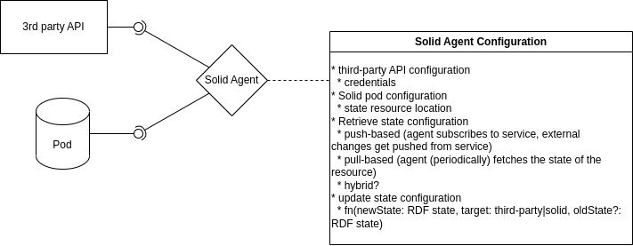

# First draft Solid agent

Proposal see: https://docs.google.com/document/d/1sORg5e7SzgOnE7WlB7waKxvijX_eQk4jMVin9x3MoAk/edit#

## High level architecture

## Internal architecture

## Compatibility

- [ ] OpenHAB
  - [ ] philips Hue light
    * https://www.openhab.org/docs/configuration/restdocs.html
    * https://www.openhab.org/docs/configuration/websocket.html
