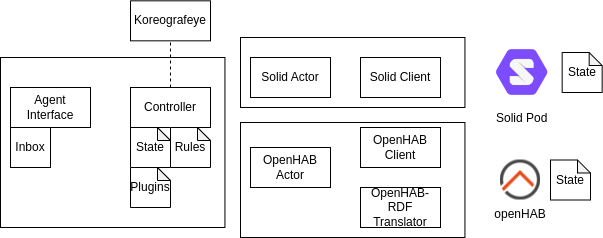
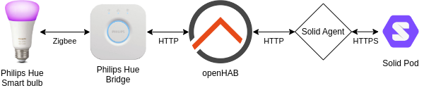

# Solid Agent

The solid agent is rule-based intelligent software agent.
It consists of a network of different actors working together.
Each actor is (part of) a component of the **hybrid web agent architecture** proposed in [Intelligent software web agents: A gap analysis](https://www.sciencedirect.com/science/article/pii/S1570826821000342) by Sabrina Kirrane.
The following actors are already implemented this library:

* The **Orchestration Actor**:
  * _Controller component_
  * _Reactive component_
  * _Interface component_
* The **openHAB Actor**:
  * _Interface component_
* The **Solid Actor**:
  * _Interface component_


A complete overview of the current Solid Agent Architecture can be seen in following figure.



## Use case: Synchronising the state of a smart home with a personal data store 


### Initialising the agent

Set up the Solid Actor:

* initialise a WebID
* configure several resources to watch
  * the mechanism for watching: on change/periodically
  * the actor to which AS announcements are send to (e.g. the Orchestration actor)

Set up the OpenHAB Actor:

* initialise a WebID
* configure the openHAB endpoint
* provide an [access token](https://www.openhab.org/docs/configuration/apitokens.html)
* configure the items to watch
    * the mechanism for watching: on change/periodically
    * the actor to which AS announcements are send to (e.g. the Orchestration actor)

Set up the Orchestration Actor:

* initialise a WebID
* Add n3 rules (examples, see [rules](./rules))

### Internal operations: How does the agent work now?

When the agent is setup for this task,
the Solid/OpenHAB Actor send [Activity Streams 2.0](https://www.w3.org/TR/activitystreams-core/) (AS2) announcements to the Orchestration Actor.

The Orchestrator Agent, receives this announcement and processes it as follows:
1. It reasons over the announcement using the configured n3 rules
2. The reasoning result is passed to the policy executor which
   1. extracts all the policies
   2. executes the policies based on the plugins and function definitions

This flow is executed with [Koreografeye](https://github.com/eyereasoner/Koreografeye).

#### Example flow: OpenHAB light its colored was changed using the openhab platform

The openHAB actor sends an AS announcement to the Orchestration agent because its color has changed to purple:

```turtle
<#uuid> a as:Announce;
    as:actor <openHAB>;
    as:object <Bureau_rechts_Color> .

<Bureau_rechts_Color> <http://www.w3.org/1999/02/22-rdf-syntax-ns#type> <https://saref.etsi.org/core/OffState> .
<Bureau_rechts_Color> <http://dbpedia.org/resource/Hue> 270 .
<Bureau_rechts_Color> <http://dbpedia.org/resource/Colorfulness> 50 .
<Bureau_rechts_Color> <http://dbpedia.org/resource/Brightness> 10 .
```

The Orchestration actor has the following rules in its engine:
* [openHABChangedRule.n3](./rules/openHABChangedRule.n3)
* [orchestratorToOpenHAB.n3](./rules/orchestratorToOpenHAB.n3)
* [orchestratorToSolid.n3](./rules/orchestratorToSolid.n3)
* [solidChangedRule.n3](./rules/solidChangedRule.n3)

In the reasoning step, only the following rule openHABChangedRule.n3 its premises match the announcement fact.
So the conclusion, i.e. the result of the reasoning over all rules, is the following:

```turtle
<75e14f61-2f3f-414f-80c8-a6371c00a431> <http://www.w3.org/1999/02/22-rdf-syntax-ns#type> <https://www.w3.org/ns/activitystreams#Announce> .
<75e14f61-2f3f-414f-80c8-a6371c00a431> <https://www.w3.org/ns/activitystreams#actor> <openHAB> .
<75e14f61-2f3f-414f-80c8-a6371c00a431> <https://www.w3.org/ns/activitystreams#object> <Bureau_rechts_Color> .
<Bureau_rechts_Color> <http://www.w3.org/1999/02/22-rdf-syntax-ns#type> <https://saref.etsi.org/core/OnState> .
<Bureau_rechts_Color> <http://dbpedia.org/resource/Hue> 272 .
<Bureau_rechts_Color> <http://dbpedia.org/resource/Colorfulness> 60 .
<Bureau_rechts_Color> <http://dbpedia.org/resource/Brightness> 21 .
_:b2_sk_0 <http://www.w3.org/1999/02/22-rdf-syntax-ns#type> <https://w3id.org/function/ontology#Execution> .
_:b2_sk_0 <https://w3id.org/function/ontology#executes> <http://example.org/hasStateChanged> .
_:b2_sk_0 <http://example.org/param1> <solid> .
_:b2_sk_0 <http://example.org/param2> <http://localhost:3000/state> .
_:b2_sk_0 <http://example.org/body> <75e14f61-2f3f-414f-80c8-a6371c00a431> .
<http://example.org/MyDemoPolicy> <https://www.example.org/ns/policy#policy> _:b2_sk_0 .
```

As mentioned executing the policies is two-fold.
First, the policy is extracted from the above output.

This is the policy with following function `ex:hasStateChanged`. 
The function *fnoHasStateChanged* is then called internally, which does the following:
> Checks whether the data from the event is isomorphic with internal state.
> When it is not isomorphic, the data has changed, so a notification is added to stream with an announcement to update an actor.
The updating of the actor is based on the policy.

This function is then executed
This means the following announcement is sent from the orchestrator actor to itself:
```turtle
@prefix as: <https://www.w3.org/ns/activitystreams#>.
<21586d1f-75e8-421a-a42b-4ec306db1d38> a as:Announce;
as:actor <orchestrator> ;
as:target <solid>;
as:to <http://localhost:3000/state>.
<Bureau_rechts_Color> <http://www.w3.org/1999/02/22-rdf-syntax-ns#type> <https://saref.etsi.org/core/OnState> .
<Bureau_rechts_Color> <http://dbpedia.org/resource/Hue> 272 .
<Bureau_rechts_Color> <http://dbpedia.org/resource/Colorfulness> 60 .
<Bureau_rechts_Color> <http://dbpedia.org/resource/Brightness> 12 .
```

This triggers another round of the Koreografeye:

The only rule now that its premises matches the above fact is the [orchestratorToSolid.n3](./rules/orchestratorToSolid.n3).
Its conclusion is the following:

```turtle
<21586d1f-75e8-421a-a42b-4ec306db1d38> <http://www.w3.org/1999/02/22-rdf-syntax-ns#type> <https://www.w3.org/ns/activitystreams#Announce> .
<21586d1f-75e8-421a-a42b-4ec306db1d38> <https://www.w3.org/ns/activitystreams#actor> <orchestrator> .
<21586d1f-75e8-421a-a42b-4ec306db1d38> <https://www.w3.org/ns/activitystreams#target> <solid> .
<21586d1f-75e8-421a-a42b-4ec306db1d38> <https://www.w3.org/ns/activitystreams#to> <http://localhost:3000/state> .
<Bureau_rechts_Color> <http://www.w3.org/1999/02/22-rdf-syntax-ns#type> <https://saref.etsi.org/core/OffState> .
<Bureau_rechts_Color> <http://dbpedia.org/resource/Hue> 272 .
<Bureau_rechts_Color> <http://dbpedia.org/resource/Colorfulness> 60 .
<Bureau_rechts_Color> <http://dbpedia.org/resource/Brightness> 12 .
_:b3_sk_0 <http://www.w3.org/1999/02/22-rdf-syntax-ns#type> <https://w3id.org/function/ontology#Execution> .
_:b3_sk_0 <https://www.w3.org/ns/activitystreams#target> <solid> .
_:b3_sk_0 <https://www.w3.org/ns/activitystreams#to> <http://localhost:3000/state> .
_:b3_sk_0 <https://w3id.org/function/ontology#executes> <http://example.org/updateSolidState> .
_:b3_sk_0 <http://example.org/body> <21586d1f-75e8-421a-a42b-4ec306db1d38> .
<http://example.org/MyDemoPolicy> <https://www.example.org/ns/policy#policy> _:b3_sk_0 .

```
And now, the policy with function `ex:updateSolidState` is extracted, resulting in *fnoUpdateSolidState* to be executed.

This function does the following:

> Updates the state of the orchestration agent with the data of the event
> Sends an action to the solid actor to the items based on the state.

So an event is sent to the inbox of a Solid Actor with webid <solid> with as target to update the resource with this state.

So this whole flow results into the ldp:resource with url `http://localhost:3000/state` 
to be synchronised with the state of the philips hue light controlled by the openhab platform.

## Feedback and questions

Do not hesitate to [report a bug](https://github.com/woutslabbinck/Solid-Agent/issues).

Further questions can also be asked to [Wout Slabbinck](wout.slabbinck@ugent.be) (developer and maintainer of this repository) or [Patrick Hochstenbach](Patrick.Hochstenbach@UGent.be) (developer and maintainer of [Koreografeye](https://github.com/eyereasoner/Koreografeye)).
