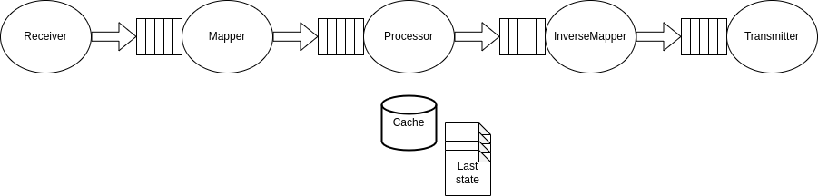
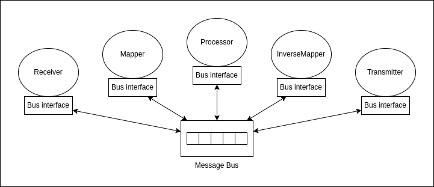

# First draft Solid agent

Proposal see: https://docs.google.com/document/d/1sORg5e7SzgOnE7WlB7waKxvijX_eQk4jMVin9x3MoAk/edit#

## High level architecture

## Internal architecture

### Version 1

**Monolithic version.**

1. The `receiver` communicates to external actors (e.g. a Solid Pod, third party API, ...) and pushes the data on a queue for the next component, the `mapper` to do its job. 
2. When the data is not RDF, the `mapper` translates it to RDF and then gets pushed to a queue for the `processor`. (Optional)
3. The `processor` reasons over the input data and based on several **rules** decides what should be done with the data.
4. If the recipient of the data is an external API, the `inverseMapper` translates RDF to the required format. (Optional, depends on `mapper` step)
5. Finally, there is the `transmitter` that speaks to the world to persist the data to whatever has been decided by the processor.

The idea here is to use queues between each process.

### Version 2

The core components still have the same job as in [version 1](#version-1).

However, now there are two new components: the `Bus interface` and the `Message Bus`.
The `Message Bus` is a publish-subscribe model for the different components to communicate their messages.
A component can either **listen to** or **publish to** the `Message Bus` with a specific topic by using a `Bus interface`.

Using the message paradigm allows for the compononents of the **Solid Agent** to not be monolithic so they can be reused in other frameworks like Nifi.

#### Example scenario

* `receiver` sends to the topic *mapper*
* `mapper` listens to the topic *mapper* and pushes to the topic *processor*
* `processor` listens to the topic *processor* and pushes to the topic *inverseMapper*
* `inverseMapper` listens to the topic *inverseMapper* and pushes to the topic *transmitter*
* `transmitter` listens to the topic *transmitter* 

### Future Work

* Api to call the Solid Agent, to start a certain configuration
  * start services
    * start syncing my lights with my pod
    * start syncing my calenders to my pod
    * start syncing strava data to my pod
    * make aggregations of something 
    * ...
  * show which capabilities the Solid Agent have
  * ...

## Compatibility

- [ ] OpenHAB
  - [ ] philips Hue light: https://www.openhab.org/docs/tutorial/things_simple.html
    * https://www.openhab.org/docs/configuration/restdocs.html
    * https://www.openhab.org/docs/configuration/websocket.html
